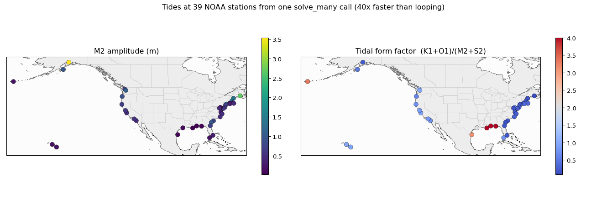
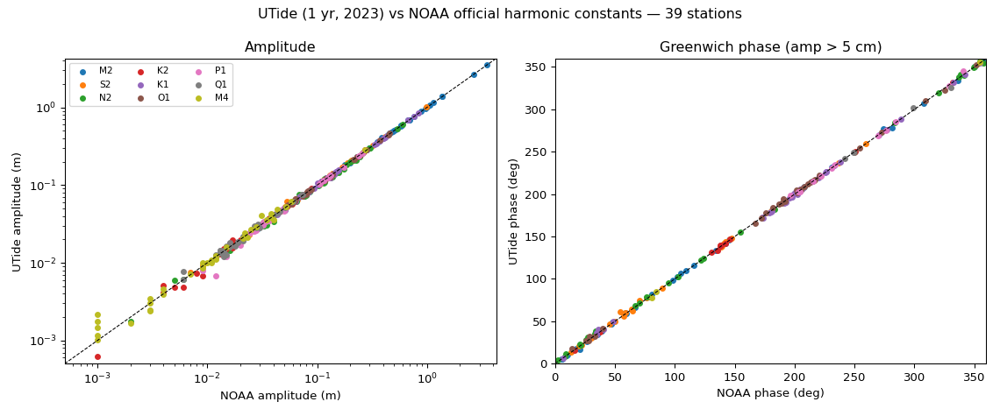
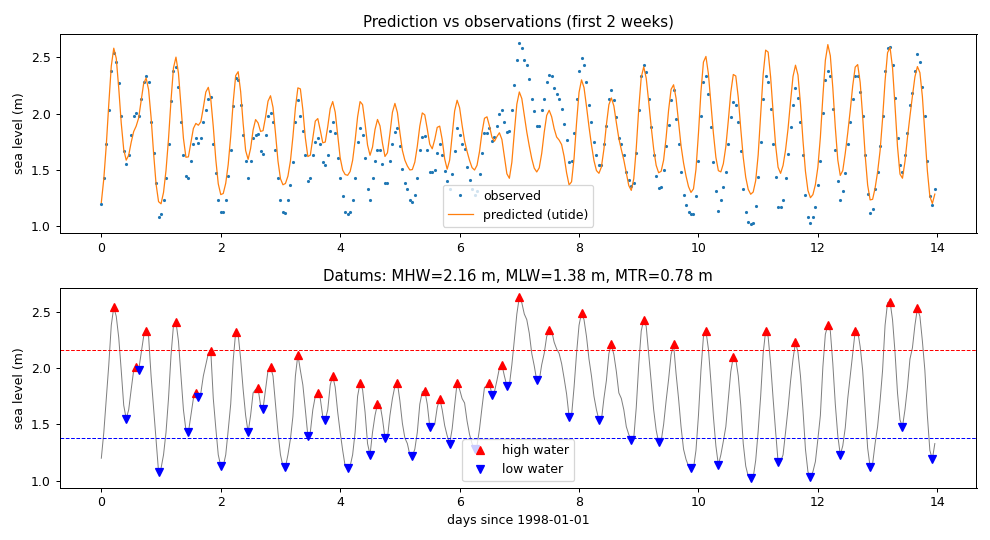

# UTide

[](https://github.com/wesleybowman/UTide/actions)
[](https://choosealicense.com/licenses/mit/)
[](https://anaconda.org/conda-forge/utide)
[](https://anaconda.org/conda-forge/utide)

Python re-implementation of the Matlab package UTide.

Still in heavy development\--everything is subject to change!

> **utide-gpu fork:** this fork adds an optional GPU (CuPy) backend and a
> batched `solve_many` solver on top of upstream UTide; see
> [GPU acceleration](#gpu-acceleration) below. The CPU behaviour is unchanged.

Note: the user interface differs from the Matlab version, so consult the
Python function docstrings to see how to specify parameters. Some
functionality from the Matlab version is not yet available. For more
information see:

    Codiga, D.L., 2011. Unified Tidal Analysis and Prediction Using the
    UTide Matlab Functions. Technical Report 2011-01. Graduate School
    of Oceanography, University of Rhode Island, Narragansett, RI.
    59pp.
    ftp://www.po.gso.uri.edu/pub/downloads/codiga/pubs/2011Codiga-UTide-Report.pdf

    UTide v1p0 9/2011 d.codiga@gso.uri.edu
    http://www.po.gso.uri.edu/~codiga/utide/utide.htm

# Installation

This fork provides the full upstream UTide API **plus** the optional GPU
backend and `solve_many`, and installs as the `utide` package. Install it from
source:

``` shell
pip install git+https://github.com/dhava-gautama/utide-gpu.git
```

For the GPU features, also install CuPy for your CUDA version. This is
optional\--without it everything runs on the CPU exactly as upstream:

``` shell
pip install cupy-cuda12x      # or cupy-cuda11x, etc., to match your CUDA
```

The upstream, CPU-only package is on PyPI and conda-forge if you do not need
the GPU additions:

``` shell
pip install utide
# or
conda install utide --channel conda-forge
```

The public functions can be imported using

```python
from utide import solve, solve_many, reconstruct
```

A sample call would be

```python
from utide import solve

coef = solve(
    time,
    time_series_u,
    time_series_v,
    lat=30,
    nodal=False,
    trend=False,
    method="ols",
    conf_int="linear",
    Rayleigh_min=0.95,
)
```

For more examples see the
[notebooks](https://nbviewer.jupyter.org/github/wesleybowman/UTide/tree/master/notebooks/)
folder.

# GPU acceleration

This fork adds an **optional GPU backend** (via [CuPy](https://cupy.dev)) and a
**batched** solver, on top of the standard UTide API. The GPU is strictly
opt-in; with `gpu=False` the CPU path is byte-identical to upstream.

```python
from utide import solve, solve_many

# Single series on the GPU (results returned on the host, identical to CPU):
coef = solve(t, h, lat=45, method="ols", conf_int="linear", gpu=True)

# Many series sharing one time base, fit in a single batched solve:
out = solve_many(t, X, lat=45, gpu=True)          # X is (ntimes, nseries)

# Optional single precision for a large extra speedup on consumer GPUs:
out = solve_many(t, X, lat=45, gpu=True, gpu_precision="single")
```

Highlights:

- `solve(..., gpu=True)` accelerates harmonic-basis construction (the dominant
  cost) and the least-squares solve, with automatic CPU fallback for the option
  combinations not yet supported on the GPU. Robust fitting
  (`method="robust"`) also runs on the device.
- `solve_many` fits many series with a shared time base in one solve\--far
  faster than looping `solve`\--and handles per-series gaps and streams large
  batches within available GPU memory.
- `reconstruct(..., gpu=True)` predicts the tide on the GPU, and
  `reconstruct_many` predicts a whole `solve_many` result (a field of series)
  in one batched call.
- `gpu_precision="single"` runs the basis and solve in float32 for a large
  speedup where the GPU's double-precision throughput is limited, at reduced
  numerical precision (intended for screening, not final-precision work).

Requires CuPy with a working CUDA device, e.g. `pip install cupy-cuda12x`. If
CuPy is not installed, importing and using UTide on the CPU is unaffected.

# Use cases

The GPU backend and `solve_many` pay off most when you have **many tidal time
series that share one time base** — an ocean-model SSH grid, satellite
altimetry, or an array of tide gauges / moorings. `solve_many` builds the
harmonic model once and solves every series in a single batched call.



*One `solve_many` call recovers the constituents at all 39 NOAA stations (one
year of real hourly data, [public domain](https://tidesandcurrents.noaa.gov)) —
matching the per-station fit to round-off and reproducing the known
oceanography: the largest M2 in Cook Inlet and the Bay of Fundy, and a diurnal
Gulf of Mexico (high form factor, right). Notebook:
[`notebooks/gpu_batch_real_example.ipynb`](notebooks/gpu_batch_real_example.ipynb).
The same call scales to thousands of model-grid cells — a synthetic 64×64 grid
runs ~240× faster than looping `solve`
([`notebooks/gpu_batch_example.ipynb`](notebooks/gpu_batch_example.ipynb)).*

**Where it shines**

- **A field of series (the big one).** `solve_many(t, X)` with `X` shaped
  `(n_times, n_series)` returns amplitudes/phases for every series at once —
  ~100×+ faster than looping `solve`, with per-series gap handling and
  streaming of batches larger than GPU memory.
- **Long, high-rate records.** `solve(t, h, gpu=True)` accelerates the
  harmonic-basis construction, which dominates the cost of a single long fit.
- **First-pass screening of huge datasets.** `gpu_precision="single"` trades a
  few digits of precision for a large extra speed-up.

**When the CPU is fine**

- A single, short record (≲ a year): the GPU's setup cost is not worth it; plain
  `solve(...)` is the right tool.

Runnable scripts: [`examples/gpu_batch_real.py`](examples/gpu_batch_real.py)
(the 39 real stations above) and
[`examples/gpu_batch_grid.py`](examples/gpu_batch_grid.py) (the synthetic grid).

# Validation

UTide reproduces NOAA's **official published harmonic constants**. Analysing one
year (2023) of hourly data at the 39 NOAA stations above and comparing against
NOAA's accepted constants (derived from ~19 years of record), amplitudes agree
to a median of **2.2 %** and Greenwich phases to **0.6°** across 349
station/constituent comparisons:



Reproduce with [`examples/noaa_validation.py`](examples/noaa_validation.py); the
check also runs in the test suite (`tests/test_noaa_validation.py`).

# Tidal datums

Alongside harmonic analysis, UTide can compute standard **empirical tidal
datums** directly from a water-level series — mean high/low water (MHW/MLW),
mean tide level (MTL), mean tidal range (MTR), and mean ebb/flood durations
(ED/FD):

```python
from utide import tidal_characteristics, tidal_characteristics_many

c = tidal_characteristics(t, h)          # one series -> MHW, MLW, MTL, MTR, ED, FD
maps = tidal_characteristics_many(t, X)  # a field (n_times, n_series) -> arrays
```

`tidal_form_factor(coef)` returns the `(K1+O1)/(M2+S2)` form factor and the
diurnal/semidiurnal classification from a `solve` or `solve_many` result.

This pairs naturally with `solve_many`: constituent maps *and* datum maps over
the same grid. The datum set follows DHI's
[tide_analytics](https://github.com/DHI/tide_analytics); this is an independent
NumPy/SciPy implementation.

# Examples

- [`notebooks/real_station_example.ipynb`](notebooks/real_station_example.ipynb)
  — the full workflow on a **real tide-gauge record** (the shipped
  `can1998.dtf`): GPU harmonic analysis, prediction versus observations, and
  tidal datums. Also available as a script,
  [`examples/real_station.py`](examples/real_station.py).
- [`notebooks/gpu_batch_real_example.ipynb`](notebooks/gpu_batch_real_example.ipynb)
  — the batch use case on **39 real NOAA tide gauges**: constituents and tidal
  classification everywhere from one `solve_many` call.
- [`notebooks/gpu_batch_example.ipynb`](notebooks/gpu_batch_example.ipynb)
  — the same over a **synthetic grid**, showing the speed-up scale to thousands
  of cells.



*UTide on a real one-year hourly record: the fitted tide predicts the
observations (M2 ≈ 0.37 m dominant, 79% of variance explained), and the high/low
waters give the datums (MHW, MLW, MTR).*
